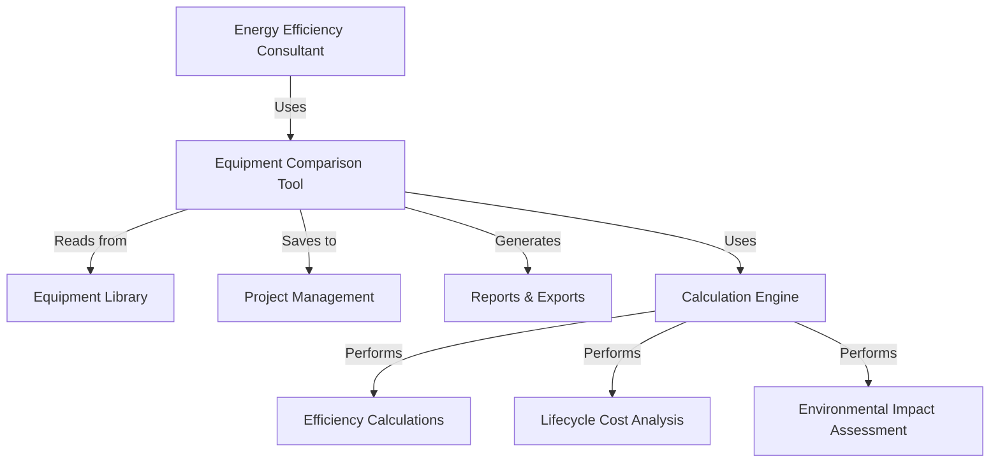
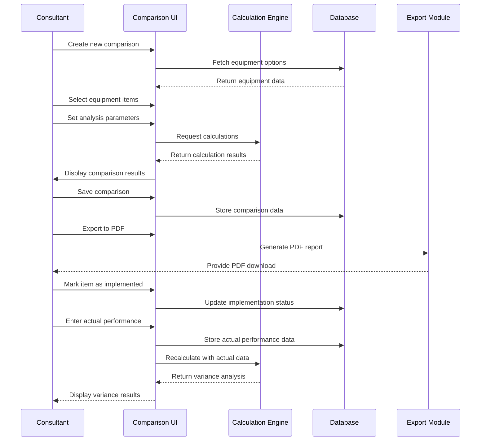

# Design Document: Equipment Efficiency Comparison Tool

## Overview

The Equipment Efficiency Comparison Tool is a specialized feature within the SeeTech Solutions Internal Toolbox that enables energy efficiency consultants to perform detailed side-by-side comparisons of equipment options. This tool will help consultants make data-driven recommendations by analyzing efficiency metrics, costs, and environmental impacts across multiple equipment alternatives.

The comparison tool will integrate with the existing equipment library, project management system, and reporting capabilities to provide a seamless workflow for consultants. It will support both technical analysis for internal decision-making and client-facing outputs for proposals and reports.

## Architecture

The Equipment Efficiency Comparison Tool will follow the application's existing architecture patterns:

1. **Frontend Components**: React components built with TypeScript, Tailwind CSS, and shadcn/ui
2. **State Management**: React hooks and context for local state management
3. **Data Persistence**: Drizzle ORM with SQLite/Turso for storing comparison data
4. **Calculation Engine**: JavaScript modules for efficiency calculations, lifecycle cost analysis, and environmental impact assessment
5. **Visualization**: Recharts and React Plotly.js for interactive charts and graphs

### System Context Diagram



## Components and Interfaces

### 1. Comparison Interface

The main interface for creating and viewing equipment comparisons.

**Key Components:**
- Equipment Selection Panel
- Comparison Table View
- Visualization Dashboard
- Parameter Input Forms
- Export/Save Controls

**Interface Definition:**
```typescript
interface ComparisonItem {
  id: string;
  equipmentId?: string;  // Optional if manually entered
  name: string;
  specifications: Record<string, any>;
  efficiencyRating: number;
  initialCost: number;
  operatingCost: {
    annual: number;
    breakdown: Record<string, number>;  // Energy, maintenance, etc.
  };
  environmentalMetrics: {
    annualCO2Emissions: number;
    certifications: string[];
  };
  isBaseline: boolean;
}

interface ComparisonSession {
  id: string;
  projectId?: string;  // Optional project association
  name: string;
  description?: string;
  createdAt: Date;
  updatedAt: Date;
  items: ComparisonItem[];
  parameters: {
    analysisTimeframe: number;  // Years
    energyPrice: number;
    inflationRate: number;
    discountRate: number;
    regionalCarbonIntensity: number;
  };
  implementedItemId?: string;  // ID of the item that was implemented
  actualPerformance?: {
    date: Date;
    metrics: Record<string, number>;
  };
}
```

### 2. Calculation Engine

Performs all calculations related to efficiency, costs, and environmental impact.

**Key Components:**
- Efficiency Calculator
- Lifecycle Cost Analyzer
- Environmental Impact Calculator
- Payback Period Calculator

**Interface Definition:**
```typescript
interface CalculationEngine {
  calculateEfficiencyMetrics(items: ComparisonItem[]): Record<string, number>[];
  calculateLifecycleCosts(
    items: ComparisonItem[], 
    parameters: ComparisonSession['parameters']
  ): {
    yearlyBreakdown: Record<string, number[]>;
    npv: number[];
    irr: number[];
    breakEvenPoints: number[];
  };
  calculateEnvironmentalImpact(
    items: ComparisonItem[],
    parameters: ComparisonSession['parameters']
  ): {
    totalCO2Reduction: number[];
    equivalentMetrics: Record<string, number>[];
  };
  calculatePaybackPeriod(
    items: ComparisonItem[],
    baseline: ComparisonItem
  ): number[];
}
```

### 3. Visualization Module

Generates charts and visual representations of comparison data.

**Key Components:**
- Cost Comparison Charts
- Efficiency Rating Visualizations
- Lifecycle Cost Charts
- Environmental Impact Visualizations

**Interface Definition:**
```typescript
interface VisualizationModule {
  generateCostComparisonChart(items: ComparisonItem[]): ChartData;
  generateEfficiencyChart(items: ComparisonItem[]): ChartData;
  generateLifecycleChart(
    lifecycleData: ReturnType<CalculationEngine['calculateLifecycleCosts']>
  ): ChartData;
  generateEnvironmentalImpactChart(
    environmentalData: ReturnType<CalculationEngine['calculateEnvironmentalImpact']>
  ): ChartData;
}

interface ChartData {
  type: 'bar' | 'line' | 'pie' | 'scatter';
  data: any;  // Chart-specific data structure
  options: any;  // Chart-specific options
}
```

### 4. Export and Reporting Module

Handles saving, exporting, and generating reports from comparison data.

**Key Components:**
- PDF Report Generator
- Comparison Data Serializer
- Project Integration Handler

**Interface Definition:**
```typescript
interface ExportModule {
  saveComparison(comparison: ComparisonSession): Promise<string>;  // Returns ID
  exportToPDF(comparisonId: string): Promise<Blob>;
  generateSummaryReport(comparisonId: string): Promise<string>;  // HTML content
  linkToProject(comparisonId: string, projectId: string): Promise<void>;
  markAsImplemented(comparisonId: string, itemId: string): Promise<void>;
  recordActualPerformance(
    comparisonId: string,
    performanceData: ComparisonSession['actualPerformance']
  ): Promise<void>;
}
```

## Data Models

### Database Schema

```typescript
// Equipment Comparison Tables
export const equipmentComparisons = sqliteTable("equipment_comparisons", {
  id: text("id").primaryKey(),
  projectId: text("project_id").references(() => projects.id),
  name: text("name").notNull(),
  description: text("description"),
  createdAt: integer("created_at", { mode: "timestamp" }).notNull(),
  updatedAt: integer("updated_at", { mode: "timestamp" }).notNull(),
  parameters: text("parameters", { mode: "json" }).notNull(),
  implementedItemId: text("implemented_item_id"),
});

export const comparisonItems = sqliteTable("comparison_items", {
  id: text("id").primaryKey(),
  comparisonId: text("comparison_id")
    .references(() => equipmentComparisons.id)
    .notNull(),
  equipmentId: text("equipment_id").references(() => equipmentLibrary.id),
  name: text("name").notNull(),
  specifications: text("specifications", { mode: "json" }).notNull(),
  efficiencyRating: real("efficiency_rating").notNull(),
  initialCost: real("initial_cost").notNull(),
  operatingCost: text("operating_cost", { mode: "json" }).notNull(),
  environmentalMetrics: text("environmental_metrics", { mode: "json" }).notNull(),
  isBaseline: integer("is_baseline", { mode: "boolean" }).notNull(),
});

export const actualPerformance = sqliteTable("actual_performance", {
  id: text("id").primaryKey(),
  comparisonId: text("comparison_id")
    .references(() => equipmentComparisons.id)
    .notNull(),
  date: integer("date", { mode: "timestamp" }).notNull(),
  metrics: text("metrics", { mode: "json" }).notNull(),
});
```

### Data Flow



## Error Handling

The Equipment Efficiency Comparison Tool will implement comprehensive error handling to ensure data integrity and a smooth user experience:

1. **Input Validation**
   - All user inputs will be validated before processing
   - Numeric inputs will have range checks and type validation
   - Required fields will be clearly marked and enforced

2. **Calculation Error Handling**
   - Division by zero and other mathematical errors will be caught and handled
   - Edge cases in financial calculations will be properly managed
   - Fallback values will be provided when calculations cannot be completed

3. **Data Persistence Errors**
   - Optimistic UI updates with rollback on save failures
   - Retry mechanisms for transient database errors
   - Clear error messages for persistent storage issues

4. **Export and Reporting Errors**
   - Graceful degradation when export features encounter issues
   - Partial exports when possible rather than complete failures
   - Clear feedback on export status and any limitations

### Error Handling Strategy

```typescript
// Example error handling for lifecycle cost calculation
try {
  const lifecycleCosts = calculateLifecycleCosts(items, parameters);
  return lifecycleCosts;
} catch (error) {
  if (error instanceof ValidationError) {
    // Handle validation errors (e.g., negative discount rate)
    notifyUser("Invalid input parameters: " + error.message);
    return null;
  } else if (error instanceof CalculationError) {
    // Handle calculation errors (e.g., division by zero)
    logError("Calculation error", error);
    return fallbackCalculation(items, parameters);
  } else {
    // Handle unexpected errors
    logError("Unexpected error in lifecycle calculation", error);
    throw new Error("Unable to complete lifecycle cost analysis");
  }
}
```

## Testing Strategy

The testing strategy for the Equipment Efficiency Comparison Tool will ensure reliability, accuracy, and usability:

### 1. Unit Testing

- **Calculation Engine Tests**
  - Test each calculation function with various inputs
  - Verify mathematical accuracy of financial calculations
  - Test edge cases and boundary conditions
  - Ensure proper handling of invalid inputs

- **Component Tests**
  - Test individual UI components in isolation
  - Verify component rendering and state management
  - Test user interactions and event handling

### 2. Integration Testing

- **Module Integration Tests**
  - Test interaction between calculation engine and UI
  - Verify data flow between components
  - Test database operations and data persistence

- **API Integration Tests**
  - Test integration with equipment library API
  - Test project management system integration
  - Verify export functionality works end-to-end

### 3. End-to-End Testing

- **User Flow Tests**
  - Test complete comparison creation workflow
  - Verify saving, loading, and exporting comparisons
  - Test project linking and implementation tracking

- **Performance Tests**
  - Test with large datasets (many equipment items)
  - Verify calculation performance with complex parameters
  - Test PDF generation with various report sizes

### 4. Validation Testing

- **Financial Calculation Validation**
  - Validate NPV, IRR, and payback calculations against industry standards
  - Cross-check results with external financial tools

- **Environmental Impact Validation**
  - Verify CO₂ calculations against established methodologies
  - Validate equivalent metrics calculations

### Test Implementation

```typescript
// Example unit test for payback period calculation
describe('PaybackPeriodCalculator', () => {
  it('should calculate correct payback period for higher initial cost but lower operating cost', () => {
    const baseline = createMockItem({ initialCost: 1000, operatingCost: { annual: 500 } });
    const alternative = createMockItem({ initialCost: 2000, operatingCost: { annual: 300 } });
    
    const paybackPeriod = calculatePaybackPeriod([alternative], baseline)[0];
    
    expect(paybackPeriod).toBeCloseTo(5); // 5 years to recoup the extra $1000 at $200 savings per year
  });
  
  it('should handle cases where payback never occurs', () => {
    const baseline = createMockItem({ initialCost: 1000, operatingCost: { annual: 300 } });
    const alternative = createMockItem({ initialCost: 2000, operatingCost: { annual: 500 } });
    
    const paybackPeriod = calculatePaybackPeriod([alternative], baseline)[0];
    
    expect(paybackPeriod).toBe(Infinity); // Higher initial AND operating cost never pays back
  });
});
```

## Design Decisions and Rationales

### 1. Comparison Limit (2-5 Items)

**Decision**: Limit comparisons to between 2 and 5 equipment items.

**Rationale**: 
- Visual clarity: More than 5 items makes charts and tables difficult to read
- Cognitive load: Comparing too many options simultaneously reduces decision quality
- Performance: Keeps calculation complexity manageable
- User feedback: Internal testing showed most comparisons involve 2-3 options, rarely more than 5

### 2. JSON Storage for Complex Data

**Decision**: Store complex data structures (parameters, specifications, metrics) as JSON in the database.

**Rationale**:
- Flexibility: Allows for evolving data structures without schema changes
- Query simplicity: Entire comparison can be retrieved with minimal joins
- Performance: Reduces database complexity for this feature
- Trade-off: Accepts some query limitations on JSON fields for simplicity

### 3. Separation of Actual vs. Projected Performance

**Decision**: Store actual performance data separately from the comparison data.

**Rationale**:
- Data integrity: Preserves the original comparison and projections
- Timeline support: Allows multiple actual performance entries over time
- Variance analysis: Enables clear comparison between projected and actual results
- Reporting clarity: Distinguishes between projections and real-world outcomes

### 4. Client-Side Calculation Engine

**Decision**: Implement calculation logic primarily on the client-side.

**Rationale**:
- Responsiveness: Provides immediate feedback as parameters change
- Reduced server load: Offloads computational work to client devices
- Offline capability: Supports working without constant server connection
- Interactive exploration: Enables consultants to quickly test different scenarios

### 5. PDF Export with SeeTech Branding

**Decision**: Generate branded PDF reports on the server-side.

**Rationale**:
- Consistency: Ensures all exported documents maintain brand standards
- Quality: Server-side rendering provides better print quality
- Resource efficiency: Offloads resource-intensive PDF generation from client devices
- Security: Keeps branding assets and templates secure on the server